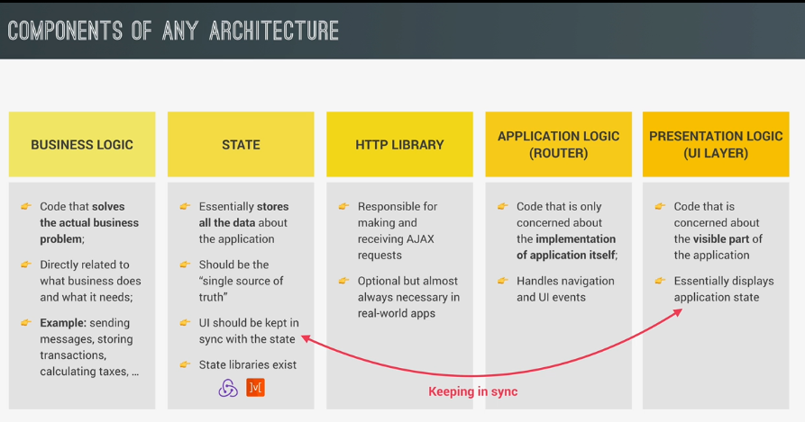

## Architecture

> like MVC,MVP,Flux,..
> use framework like React,Angular,Vue,Svlte,etc
> state libraries: redux,Mobx

### Components of any architecture



### MVC

> only controller who imports and call functions from the model
> and from the view, but never the other way around
> model and controller implemented as module,but the view is implemented by a class.

# note

> whenever an async function call another async function,we need to handle it.
> an async function returns a promise and we need to handle it by await.
> uppercase variables use for constant variables that dont change
> In MVC pattern the view does not know about the controller, it doesnt import the controller. SOLUTION: publisher subscriber pattern

## Publisher and Subscriber

- Publisher: which is some code that know when to react.
- Subscriber:which is some code that actually wants to react.
  > we can subscribe to publisher by passing the subscriber function as an augument

> when we submit a form,we need to prevent default actions,otherwise the page will reload

```js
this.#parentEl.addEventListener('submit', function (e) {
  e.preventDefault();
  handler();
});
```

## window history

```js
// Change ID in the url
window.history.pushState(null, '', `#${model.state.recipe.id}`);
// go to the previous page
```

## Write documentation

- jsdoc.app

```js
/**
 * Render the recieved object to the DOM
 * @param {Object | Object[]} data The data to be rendered(e.g recipe)
 * @param {boolean} [=true] If false,create markup string instead of rendering to the DOM
 * @returns
 */
```

## Deploy static web application

- netlify: for front-end applications
- surge

## Git

- go to previous commits:
  git reset --hard HEAD
- all commits:
  1. git log
  2. take the id
  3. to quit write q
  4. git reset --hard id
- create new branch:

1. git branch: show all branch
2. git branch "name":create a brach
3. git checkout "name": to move to that branch
4. git merge "name"

- to push:
- git remote add origin "url of repository"
- git push origin master
- git push origin master: master is the name of the branch we want to push into git
- github cheatsheet
